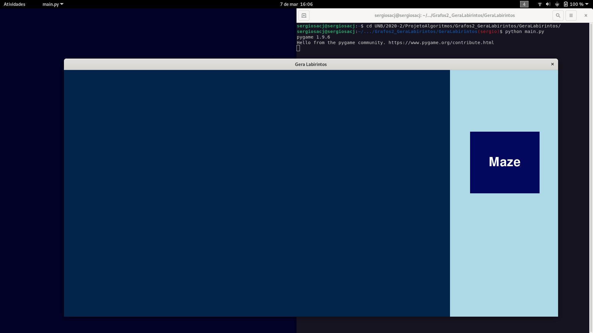
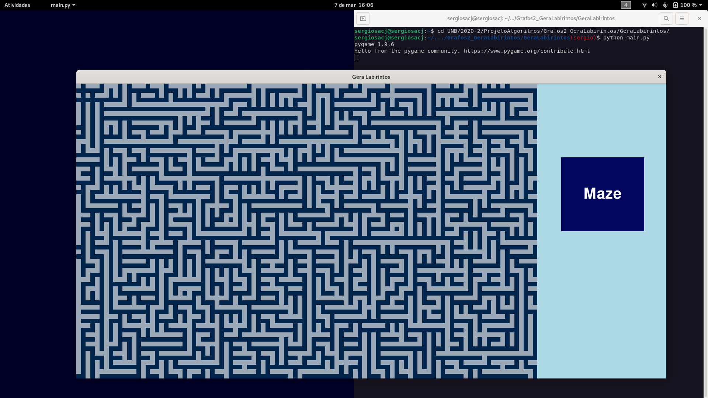

# Kruskal Maze Generator

**Número da Lista**: 6<br>
**Conteúdo da Disciplina**: Greed<br>

## Alunos

|Matrícula | Aluno |
| -- | -- |
| 18/0037439  |  Sérgio de Almeida Cipriano Júnior |
| 18/0030264  |  Antonio Igor Carvalho |

## Sobre 

O objetivo do projeto era de criar um gerador de labirintos aleatório utilizando
o algoritmo Prim. Desse modo, fizemos algumas alterações no algoritmo princiapl,
para que atendesse nosso objetivo. Ao invés de remover a célula com menor peso,
nós aleatoriamente conectávamos um dos vizinhos.

## Screenshots

<div align="center">
  
</div>

<div align="center">
  
</div>

<div align="center">
  
</div>

<div align="center">
  
</div>

## Instalação

**Linguagem**: python3 <br>
**Biblioteca**: python3-pygame <br>

O único pré requisito é ter o interpretador python3 instalado e a biblioteca pygame.

```
$ git clone https://github.com/projeto-de-algoritmos/Grafos2_GeraLabirintos.git
$ python3 Grafos2_GeraLabirintos/GeraLabirintos/main.py
```

## Uso

Clicar no botão "Maze" e ir gerando labirintos aleatórios.
